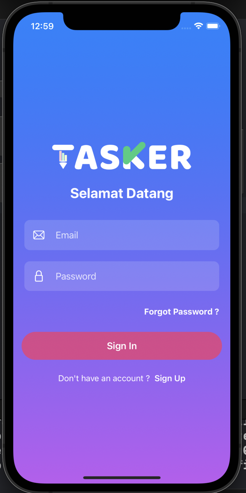

# Tasker

<!-- ABOUT THE PROJECT -->
<p align="center">
  <a href="#" target="_blank"></a>
</p>

Aplikasi Tasker adalah aplikasi iOS To Do List (Advanced Level) yang dibuat menggunakan Firebase (Firestore, Firestore Swift, Auth, Database, Function, dan Storage), SwiftUI, dan MVVM Design Pattern.

### Preview
<p align="center">
    <a href="#" target="_blank"></a>
</p>

<!-- ABOUT THE FILE & FOLDER STRUCTURE -->
## Folder & File Structure
Berikut struktur file dan folder pada Tasker:

    .
    ├── TaskerApp.swift            # Root Project: Konfirgurasi Firebase Firestore
    ├── ContentView.swift          # Tampilan Beranda Aplikasi
    ├── Assets                     # Aset Logo dan Warna
    ├── Component                  # Component: Berisikan Recyclable Element (Button, Search Bar, dan Text Field)
    │   ├── SearchBarView.swift           # Berisikan 
    │   ├── BackgroundGradientView.swift  # Berisikan 
    │   ├── TODOButtonStack.swift.        # Berisikan 
    │   ├── AddTODOLogo.swift             # Berisikan 
    │   ├── LogoView.swift                # Berisikan 
    │   ├── BlankView.swift               # Berisikan 
    │   ├── AuthenticateButtonView.swift  # Berisikan 
    │   ├── CustomTextEditor.swift        # Berisikan 
    │   └── TextFields                    # Berisikan 
    │       ├── CustomTextField.swift     # Berisikan 
    │       ├── EmailTextField.swift      # Berisikan 
    │       ├── CustomSecureField.swift   # Berisikan 
    │       ├── PasswordSecureField.swift # Berisikan 
    │       ├── UserTextField.swift       # Berisikan 
    │       └── TODOTextField.swift       # Berisikan 
    │
    ├── Model                     # Model: Firebase Data Declaration (Collection)
    │   ├── Constant.swift        # Berisikan 
    │   ├── AppUser.swift         # Berisikan 
    │   ├── TODO.swift            # Berisikan 
    │   ├── SelectedButton.swift  # Berisikan
    │   └── MockData.swift        # Berisikan 
    │
    ├── ViewModel                # ViewModel: Fungsi CRUD (TODO & Auth)
    │   ├── AuthViewModel.swift  # Berisikan 
    │   └── TODOViewModel.swift  # Berisikan 
    │
    └── View                      # View: Controller UI & Frontend Related (Show & Get)
        ├── DashboardView.swift   # Berisikan Tampilan Dashboard
        ├── TODOView.swift        # Berisikan Tampilan TODO (Card)
        ├── CreateTODOView.swift  # Berisikan Tampilan Pop Up Create TODO
        └── Auth                  
            ├── LoginView.swift   # Berisikan Tampilan Halaman Login
            └── SignupView.swift  # Berisikan Tampilan Halaman Register 

<!-- List of Features -->
## Features:

* CRUD -> Task, Kategori Task, Search History, dan User
* MVVM Design Pattern
* Login
* Register
* Filter Kategori
* Search

<!-- Used Tools -->
## Build With:

* [Swift](https://www.swift.org/documentation/)
* [SwiftUI](https://developer.apple.com/documentation/swiftui/)
* [Xcode](https://developer.apple.com/xcode/)
* [Firebase / Firestore](https://firebase.google.com/)

<!-- How to Install -->
## Installation
Untuk menggunakan repositori ini, ikutilah petunjuk penggunaan berikut dan pastikan git sudah terinstall pada komputer (semua perintah dilaksanakan pada `cmd.exe` atau `terminal`):

1. Lakukan download .zip atau `clone` repositori dengan cara:
```bash
git clone https://github.com/dekapd99/Tasker.git
```

2. Jika sudah silahkan buka Project di Xcode
3. Build Setting > Always Embed Swift Standard Libraries (Set to YES) & Build Active Architure Only (Set to YES)
4. Firebase Swift Packages Used (Firebase Analytics, Firebase Analytics Swift, Firebase Auth, Firebase Crashlytics, Firebase Database, Firebase Database Swift, Firebase Firestore, Firebase Firestore Swift, Firebase Functions, Firebase Storage)
5. Build & Run

<!-- What Kind of License? -->
## License
No License 

<p align="right">(<a href="#top">back to top</a>)</p>
