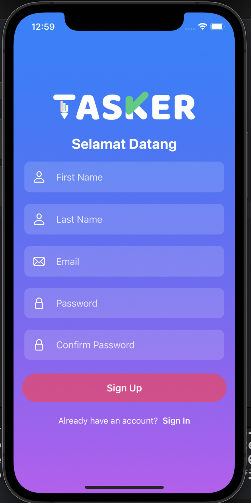
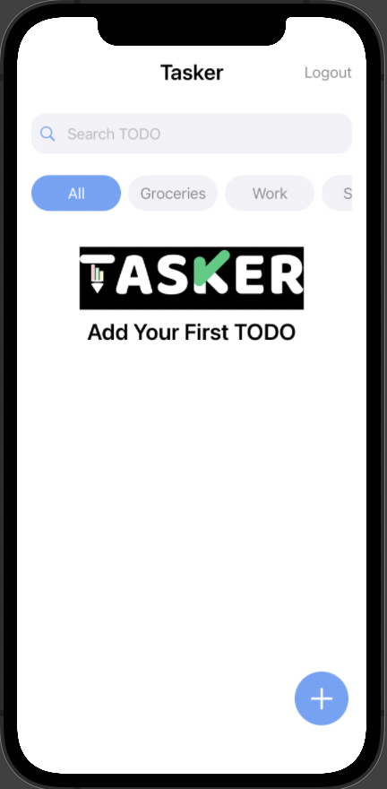

# Tasker

<!-- ABOUT THE PROJECT -->
<p align="center">
  <a href="#" target="_blank"></a>
</p>

Aplikasi Tasker adalah aplikasi iOS To Do List (Advanced Level) yang dibuat menggunakan Firebase (Firestore, Firestore Swift, Auth, Database, Function, dan Storage), SwiftUI, dan MVVM Design Pattern.

### Preview
<p align="center">
  <a href="#" target="_blank"></a>
  <a href="#" target="_blank"></a>
  <a href="#" target="_blank"></a>
</p>

<!-- ABOUT THE FILE & FOLDER STRUCTURE -->
## Folder & File Structure
Berikut struktur file dan folder pada Tasker:

    .
    ├── TaskerApp.swift            # Root Project: Konfirgurasi Firebase Firestore
    ├── ContentView.swift          # Tampilan Beranda Aplikasi
    ├── Assets                     # Aset Logo dan Warna
    ├── Component                  # Component: Berisikan Recyclable Element (Button, Search Bar, dan Text Field)
    │   ├── SearchBarView.swift           # Berisikan UI Forms Search Bar
    │   ├── BackgroundGradientView.swift  # Berisikan UI Background Gradient Color 
    │   ├── TODOButtonStack.swift.        # Berisikan UI TODO Button Horizontal Stacks 
    │   ├── AddTODOLogo.swift             # Berisikan Tampilan UI Ketika TODO List Kosong 
    │   ├── LogoView.swift                # Berisikan Tampilan UI Logo di Halaman Login dan Register 
    │   ├── BlankView.swift               # Berisikan Tampilan Overlay ketika Pop Up Create TODO
    │   ├── AuthenticateButtonView.swift  # Berisikan UI Tombol Auth (Login & Register) 
    │   ├── CustomTextEditor.swift        # Berisikan UI Forms TODO Descriptions 
    │   └── TextFields                    # Component -> TextFields: Berisikan Placeholder Custom TextFields 
    │       ├── CustomTextField.swift     # Berisikan Custom Text Field untuk Input Segala Jenis Forms 
    │       ├── EmailTextField.swift      # Berisikan UI Forms Email Text Field 
    │       ├── CustomSecureField.swift   # Berisikan Custom Secure Field khusus untuk Input Forms Password 
    │       ├── PasswordSecureField.swift # Berisikan UI Forms Password Text Field 
    │       ├── UserTextField.swift       # Berisikan UI Forms User Text Field untuk Input Data Pribadi User 
    │       └── TODOTextField.swift       # Berisikan UI Forms TODO User Field untuk Input Data Title TODO 
    │
    ├── Model                     # Model: Firebase Data Declaration (Collection)
    │   ├── Constant.swift        # Berisikan Akses Firestore dan Akses Entitas "users" di Collection
    │   ├── AppUser.swift         # Berisikan Data Declaration untuk Informasi Users 
    │   ├── TODO.swift            # Berisikan Data Declaration untuk Informasi TODO 
    │   ├── SelectedButton.swift  # Berisikan All Case Category dari TODO
    │   └── MockData.swift        # Berisikan data Dummy di Preview SwiftUI
    │
    ├── ViewModel                # ViewModel: Fungsi CRUD (TODO & Auth)
    │   ├── AuthViewModel.swift  # Berisikan Fungsi Login / Register / Sign Out 
    │   └── TODOViewModel.swift  # Berisikan Fungsi Load, Create, Delete, Complete, & Uncomplete TODO 
    │
    └── View                      # View: Controller UI & Frontend Related (Show & Get)
        ├── DashboardView.swift   # Berisikan Tampilan Dashboard
        ├── TODOView.swift        # Berisikan Tampilan TODO (Card)
        ├── CreateTODOView.swift  # Berisikan Tampilan Pop Up Create TODO
        └── Auth                  # View -> Auth: Berisikan Tampilan Halaman Autentikasi User
            ├── LoginView.swift   # Berisikan Tampilan Halaman Login
            └── SignupView.swift  # Berisikan Tampilan Halaman Register 

<!-- List of Features -->
## Features:

* CRUD -> Task, Kategori Task, Search History, dan User
* MVVM Design Pattern
* Login
* Register
* Filter Kategori
* Search

<!-- Used Tools -->
## Build With:

* [Swift](https://www.swift.org/documentation/)
* [SwiftUI](https://developer.apple.com/documentation/swiftui/)
* [Xcode](https://developer.apple.com/xcode/)
* [Firebase / Firestore](https://firebase.google.com/)

<!-- How to Install -->
## Installation
Untuk menggunakan repositori ini, ikutilah petunjuk penggunaan berikut dan pastikan git sudah terinstall pada komputer (semua perintah dilaksanakan pada `cmd.exe` atau `terminal`):

1. Lakukan download .zip atau `clone` repositori dengan cara:
```bash
git clone https://github.com/dekapd99/Tasker.git
```

2. Jika sudah silahkan buka Project di Xcode.
3. Buka website Firebase dan lakukan Login, kemudian klik Go To Console dan Add Projects. Pastikan namanya adalah "Tasker" dan matikan Google Analytic karena tidak diperlukan.
4. Tambahkan iOS pada Project Tasker di Firebase Console.
5. Pastikan nama Bundle ID sesuai dengan Bundle ID Project di Xcode dan Klik Register.
6. Setelah itu, Download Config File (GoogleService-Info.plist) yang diberikan oleh Firebase dan klik Next.
7. Drag & Drop Config File (GoogleService-Info.plist) yang diberikan oleh Firebase ke dalam Project Navigation.
8. Pastikan Cek: Build Setting > Always Embed Swift Standard Libraries (Set to YES) & Build Active Architure Only (Set to YES).
9. Kembali ke Firebase Console > Buka Side Bar > Klik Build > Firestore Database > Klik Create Database > Start Test Mode & Set Cloud Firestore sesuai Default
10. Build & Run

<!-- What Kind of License? -->
## License
No License 

<p align="right">(<a href="#top">back to top</a>)</p>
